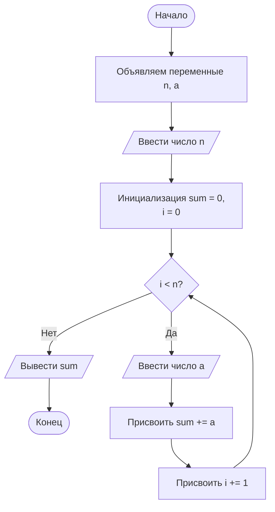
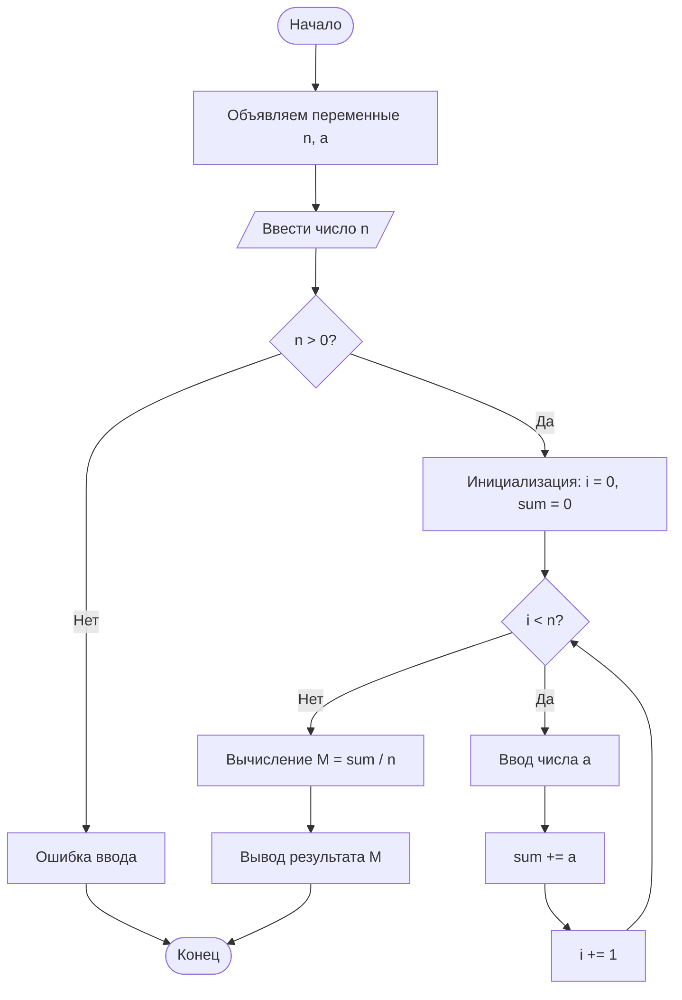
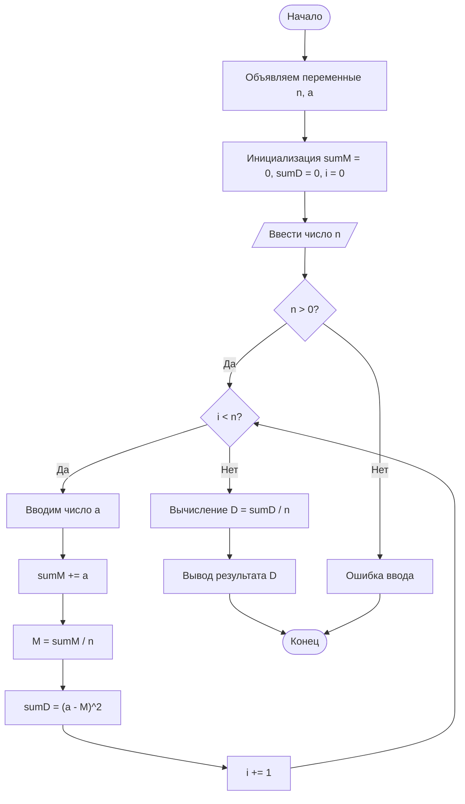
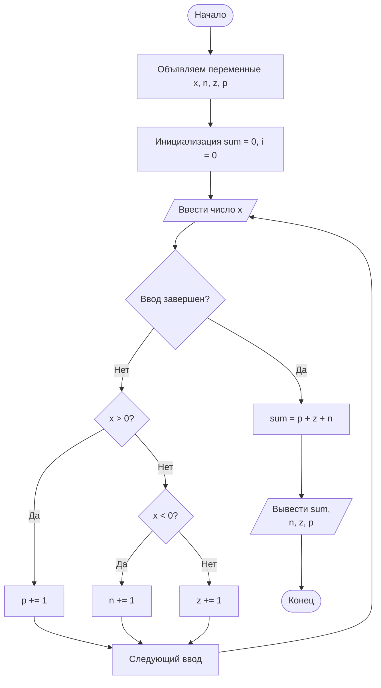

# Домашняя работа по введению в программирование
## Работу выполнил студент первого курса - Сальцев Ярослав Б25-507
## Домашняя работа №1
### Задание 1.2.1

### Задание 1.2.4

### Задание 1.2.5

### Задание 1.2.8
